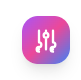

# TailorPal - Digital Tailoring Assistant

<div align="center">
  
  
  <h3>Streamline your tailoring business with smart customer management, order tracking, and automated reminders</h3>
  
  [](https://reactjs.org/)
  [](https://firebase.google.com/)
  [](https://tailwindcss.com/)
  [](https://web.dev/progressive-web-apps/)
</div>

---

## 🌟 Overview

TailorPal is a comprehensive digital solution designed specifically for Nigerian tailors and fashion entrepreneurs. Built with modern web technologies, it transforms traditional tailoring business management into a streamlined, efficient digital experience.

### ✨ Key Features

- **👥 Customer Management** - Comprehensive customer profiles with detailed measurements and order history
- **📋 Order Tracking** - Complete order lifecycle management from creation to delivery
- **📏 Smart Measurements** - Gender-specific measurement templates for traditional Nigerian garments
- **💰 Financial Tracking** - Revenue, expenses, and profit analysis with detailed reporting
- **📱 Mobile-First Design** - Responsive interface optimized for all devices
- **🔄 Real-time Sync** - Cloud-based data synchronization across devices
- **📊 Analytics Dashboard** - Business insights and performance metrics
- **🎨 Style References** - Image uploads and detailed style descriptions
- **📦 Inventory Management** - Track materials, tools, and shop expenses
- **🔔 PWA Support** - Install as a native app with offline capabilities

## 🚀 Technology Stack

### Frontend
- **React 18** - Modern UI library with hooks and functional components
- **Redux Toolkit** - Predictable state management
- **React Router** - Client-side routing and navigation
- **Tailwind CSS** - Utility-first CSS framework for rapid styling
- **Chart.js** - Interactive charts and data visualization

### Backend & Services
- **Firebase Authentication** - Secure user authentication and authorization
- **Cloud Firestore** - NoSQL database for real-time data storage
- **Firebase Storage** - File storage for images and documents
- **Firebase Analytics** - User behavior and app performance tracking

### Development Tools
- **Vite** - Fast build tool and development server
- **ESLint** - Code linting and quality assurance
- **PostCSS** - CSS processing and optimization

### PWA Features
- **Service Worker** - Offline functionality and caching
- **Web App Manifest** - Native app-like installation
- **Responsive Design** - Optimized for mobile and desktop

## 📱 Screenshots

<div align="center">
  
  
</div>

## 🛠️ Installation & Setup

### Prerequisites
- Node.js (v16 or higher)
- npm or yarn package manager
- Firebase account for backend services

### 1. Clone the Repository
```bash
git clone https://github.com/yourusername/tailorpal.git
cd tailorpal
```

### 2. Install Dependencies
```bash
npm install
```

### 3. Environment Configuration
Create a `.env` file in the root directory with your Firebase configuration:

```env
VITE_FIREBASE_API_KEY=your_api_key
VITE_FIREBASE_AUTH_DOMAIN=your_auth_domain
VITE_FIREBASE_PROJECT_ID=your_project_id
VITE_FIREBASE_STORAGE_BUCKET=your_storage_bucket
VITE_FIREBASE_MESSAGING_SENDER_ID=your_messaging_sender_id
VITE_FIREBASE_APP_ID=your_app_id
VITE_FIREBASE_MEASUREMENT_ID=your_measurement_id
```

### 4. Firebase Setup
1. Create a new Firebase project at [Firebase Console](https://console.firebase.google.com/)
2. Enable Authentication with Email/Password provider
3. Create a Firestore database
4. Enable Firebase Storage
5. Copy your configuration to the `.env` file

### 5. Start Development Server
```bash
npm run dev
```

The application will be available at `http://localhost:5173`

### 6. Build for Production
```bash
npm run build
```

## 📁 Project Structure

```
tailorpal/
├── public/                 # Static assets and PWA files
│   ├── icons/             # App icons for different sizes
│   ├── manifest.json      # PWA manifest
│   └── sw.js             # Service worker
├── src/
│   ├── components/        # Reusable UI components
│   │   ├── dashboard/     # Dashboard-specific components
│   │   └── ...
│   ├── pages/            # Page components
│   ├── store/            # Redux store and slices
│   ├── utils/            # Utility functions and helpers
│   ├── firebase/         # Firebase configuration
│   └── hooks/            # Custom React hooks
├── .env                  # Environment variables
└── package.json          # Dependencies and scripts
```

## 🎯 Usage Guide

### Getting Started
1. **Sign Up** - Create your account with email and password
2. **Create Shop** - Set up your tailoring business profile
3. **Add Customers** - Register customers with their measurements
4. **Create Orders** - Track orders from creation to completion
5. **Manage Inventory** - Keep track of materials and expenses

### Key Workflows

#### Customer Management
- Add new customers with comprehensive profiles
- Store detailed measurements for different garment types
- Track customer order history and preferences

#### Order Processing
- Create orders with specific garment requirements
- Upload style reference images
- Track order status from pending to delivered
- Manage payments and outstanding balances

#### Business Analytics
- Monitor revenue, expenses, and profit margins
- Track order completion rates
- Analyze customer trends and preferences

## 🌍 Deployment

### Netlify (Recommended)
1. Build the project: `npm run build`
2. Deploy the `dist` folder to Netlify
3. Configure redirects for SPA routing

### Vercel
1. Connect your GitHub repository to Vercel
2. Configure build settings:
   - Build Command: `npm run build`
   - Output Directory: `dist`
3. Add environment variables in Vercel dashboard

### Firebase Hosting
```bash
npm install -g firebase-tools
firebase login
firebase init hosting
firebase deploy
```

## 🤝 Contributing

We welcome contributions to TailorPal! Please follow these steps:

1. Fork the repository
2. Create a feature branch: `git checkout -b feature/amazing-feature`
3. Commit your changes: `git commit -m 'Add amazing feature'`
4. Push to the branch: `git push origin feature/amazing-feature`
5. Open a Pull Request

### Development Guidelines
- Follow the existing code style and conventions
- Write meaningful commit messages
- Add tests for new features
- Update documentation as needed

## 📄 License

This project is licensed under the MIT License - see the [LICENSE](LICENSE) file for details.

## 🆘 Support

If you encounter any issues or have questions:

- 📧 Email: hassanaabdll1@gmail.com
- 📱 Phone: +234 8060618637
- 🐛 Issues: [GitHub Issues](https://github.com/yourusername/tailorpal/issues)

## 🙏 Acknowledgments

- Built with ❤️ for Nigerian tailors and fashion entrepreneurs
- Inspired by the need to digitize traditional tailoring businesses
- Special thanks to the open-source community for the amazing tools and libraries

---

<div align="center">
  <p>Made with ❤️ by <a href="https://github.com/yourusername">Hassan Abdullah</a></p>
  <p>© 2024 TailorPal. All rights reserved.</p>
</div>